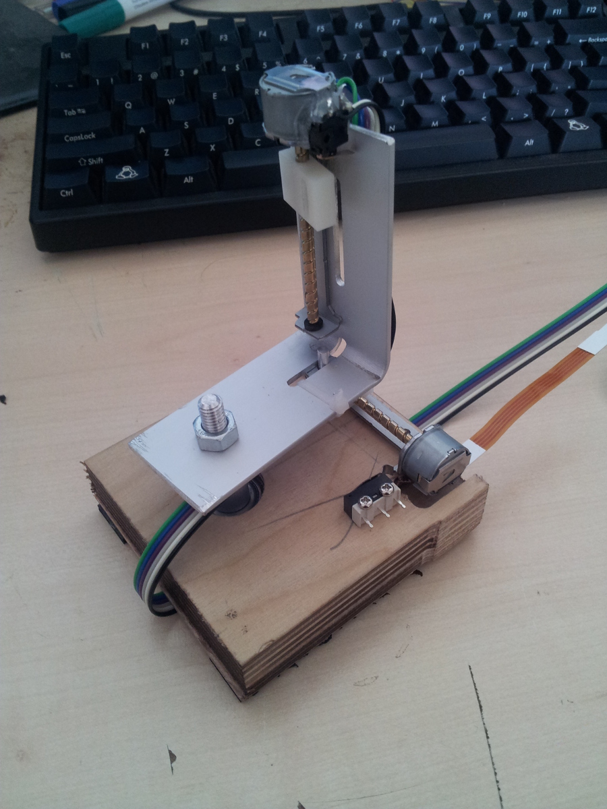

2d-thermography
===============

Aquire points or render a 2d-thermography image  using a MLX90614 IR thermometer

This project is mainly going to be a proof of concept :

The main purpose is to control smoothly the hardware and aquire
points as fast as possible throw a serial line. Image rendering
will be done by octave.

hardware :
--

    - 2 cd stepper
    - MLX90614ESF-DCI
    - a laser pointer
    - 2 Pololu A4988 or ITEAD Dual Step Motor Driver Shield

BOM :
--

http://shop.boxtec.ch/infrared-thermometer-sensor-medical-mlx90614esf-dci-p-40658.html
http://www.aliexpress.com/snapshot/6167745304.html
http://www.aliexpress.com/snapshot/6124275888.html
http://imall.iteadstudio.com/im120417015.html

