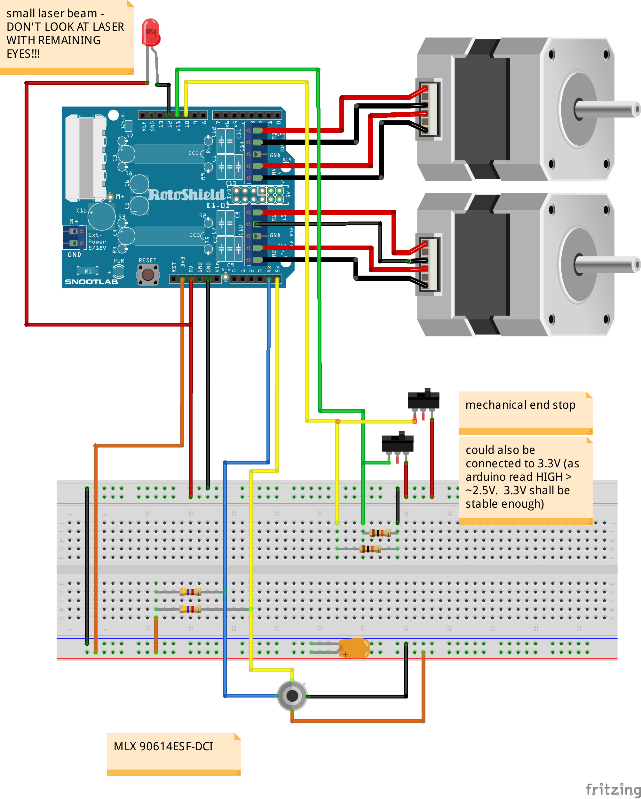
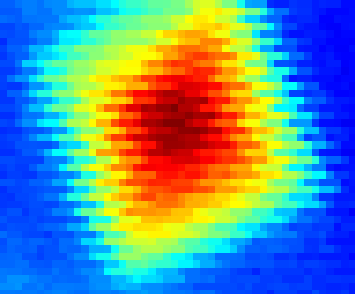
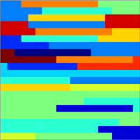
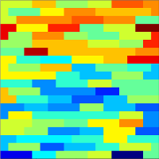
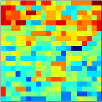
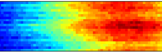

.. include:: /home/seba/documents/hepia/cours/.conf/labo.rst

.. |cours_name| replace:: ITI - Univérsité d'été
.. |auteur| replace:: Sebastien Chassot, sebastien.chassot@etu.hesge.ch ( GnuPG 0x3F432F8E )
.. |sujet| replace:: Thermographe
.. |creation_date| replace:: 26.08.2014
.. |revision| replace:: 1.0

Thermographe
=============

Introduction
-------------

Le but de ce travail était de générer un thermogramme à l’aide d’un thermomètre infrarouge.

Deux moteurs pas-à-pas orientent un capteur IR en 2 dimensions. Ce mécanisme permet de balayer
une surface (X-Y). Pour chaque coordonnée, une mesure de température est effectuée. Au final, les données
permettent de générer une cartographie thermique de la surface sous forme d’image (ou thermogramme).

Matériel (BOM)
---------------

 * Arduino (Uno)
 * thermomètre MLX90614ESF-DCI (version médicale focal 5°)
 * Dual step motor shield
 * 2 switch
 * 2 moteurs PàP de CDRom (tête de lecture)
 * 4 résistances pullup (pour SMBus et les switch)
 * 1 capacité de découplage (recommandé pour SMBus)

Montage
---------

thermomètre IR
...............

Le montage a été relativement facile. J'ai perdu du temps avec le câblage du capteur MLX90614 en interprétant mal la datasheet (vue de dessus, vue de dessous). Le capteur est sur un bus SMBbus (proche de l'I2C). Pour le faire fonctionner, la librairie wire.h de l'arduino ne suffit pas. On peut trouver une librairie "améliorée" sous le nom i2cmaster.h et des exemples de code pour récupérer les données du MLX90614. Le bus est monté avec deux pullup et une capacité de découplage.

Dual step motor shield
.......................

Une des difficultés qui m'a fait perdre le plus de temps a été un problème avec le moteur de l'axe Y. Le signal de la sortie (Y1B) était étrange et le moteur ne faisait que des oscillations. Nous avons changé le driver moteur (A3967) ce qui n'a pas résolu le problème. J'ai finalement découvert qu'une pin touchait le blindage du connecteur USB de l'arduino - un problème fréquent. La shield est facile à utiliser. Une Pin contrôle la direction du moteur, deux Pins le micro stepping (1, 1/2, 1/4, 1/8) et une Pin sert aux steps. Un pulse de 1us minimum équivaut à un pas. Il suffit de générer un signal pour les faire tourner.

Endstop
.......

Les endstop sont montés avec des résistances de pulldown comme pour des boutons. Il n'y a pas d'anti rebond dans le code puisque leurs états est lu puis suivit d'un déplacement. À la lecture leur état est stable (au pire il y a une erreur d'un pas).

Deformations et defaut de l'image
----------------------------------

Déformations
.............

L'image est déformée pour plusieurs raisons. Tout d'abord, la distance entre deux points n'est pas la même à 1m qu'à 2m ( x ~= distance*tg(a) ce qui implique que x proportionnel à la distance). De plus si l'on est perpendiculaire à une surface la distance n'est pas la même au centre (leger effet oeil-de-boeuf). L'effet est encore plus important en n'étant pas perpendiculaire à la surface. Autre cas, si l'on mesure plusieurs sujets sur des plans différents, leur résolution respective ne sera pas la même.

Problème d'entrelacement  
..........................

En mesurant des objets au contour net, l'image est entrelacée. Comme la lecture se fait par aller-retour, les pixels sont ajouté à la matrice tantôt de gauche à droite, tantôt de droite à gauche. Un décalage du flux de donnée pourrait expliquer ça. Un délai entre la mesure, la transmission et le traitement aurait aussi pu expliquer cela. Après vérification, le problème apparaît être mécanique. Il est dû au rattrapage du jeu de la vis (plusieurs pas moteur ne font aucun mouvement). La communication a été testée en envoyant des constantes (valeurs différentes G-D et D-G). Ce test a néanmoins permis de mettre en évidence des erreurs de lecture à 115200 bauds.  Pour éliminer les délais lors de la lecture, en fin de ligne, le capteur est lu 10 fois "à vide" pour garantir de partir avec une valeur "propre".

Effet flou
...........

Le capteur ayant un angle de 5°, ce n'est pas un point mais une zone qui est lue. Il y a un prépondérance de lecture au centre avec une influence décroissante sur les bords. Il reste que l'on ne lit pas la température exacte d'un point mais d'une zone.

Temps de lecture
-----------------

Au début, j'ai essayé d'obtenir la vitesse de déplacement la plus rapide afin de réduire le temps d'acquisition. Les premiers résultats avaient une succession de valeurs identiques (5,6 pixels). Le problème vient du temps de réaction du capteur (la datasheet n'en parle apparemment pas). Pour résoudre le problème, j'ai dû augmenter le temps entre les mesures à 90ms. Ce delay rallonge considérablement le temps de mesure.

Calibration
------------

Pour calibrer, j'ai utilisé le laser et des lignes sur le murs. Il y a une petite dérive (perte de pas) que j'ai corrigé "en dure" dans le sketch arduino. Les problèmes restant sont mécanique comme dans cet exemple...

Octave et code
---------------

L'arduino en s'allumant vient chercher le zero et se met en attente. Depuis octave, on envoi les variables; le nombre de points en X, en Y, le MS et le délai entre les mesures.

    ex. 100,50,4,4,90 (x=100,y=50,msx=4,msy=4,delay=90)

Une fois que l'arduino a reçu ces variables il commence le scan et renvoi les datas à octave qui les mets dans une matrice.

Pour améliorer le contraste, on normalise la matrice qui est affichée avec une colormap HSV (hue-saturation-value). Les valeurs min, max et la température moyenne du capteur est également retournée.

Résultats et conclusions
-------------------------

Les résultats sont plutôt encourageants. Alors qu'au début, obtenir des données n'était pas garanti arriver à une image cohérente est déjà bien. Les caméras thermiques restent aujourd'hui encore très cher et inaccessible au publique, pour quelques dizaines de francs, le résultats est satisfaisant. La résolution est faible (à noter que les capteurs de caméra commencent à 32x32 pts)

Mécaniquement, le montage n'est pas parfait mais ce n'était pas l'objet de ce travail. 
